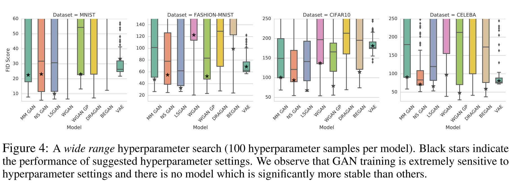

# Auto Encoder Nets
Pioneering work in AE:

A Comparison btw VAE and other GAN models in FID score (The smaller the FID, the more realistic the result.)

## Credits

Overall Theories: 
- [Variational Autoencoders: A Brief Survey](https://harkiratbehl.github.io/projects/vae/vae.pdf)
- [From Variational to Deterministic Autoencoders](https://arxiv.org/abs/1903.12436)
- [Are GANs Created Equal?](http://papers.nips.cc/paper/7350-are-gans-created-equal-a-large-scale-study)

Dazzling Apps:
- [ALAE](https://github.com/podgorskiy/ALAE)
- [Symmetric Deformable 3D](https://github.com/elliottwu/unsup3d)
